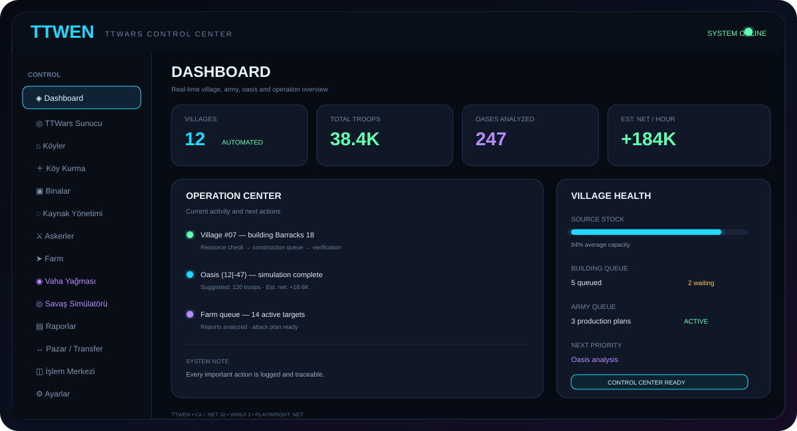

# ⚡ TTWEN — TTWars Control Center

<p align="center">
  
</p>

<p align="center">
  <strong>TTWars için ayrıntılı, sürekli çalışan Windows otomasyon ve yönetim merkezi.</strong><br>
  C# · .NET 10 LTS · WinUI 3 · Windows App SDK · Playwright .NET
</p>

<p align="center">
  
  
  
  
</p>

---

## ✦ TTwen nedir?

**TTwen**, TTWars sunucusunu tek bir masaüstü panelinden yönetmek, analiz etmek ve otomatikleştirmek için tasarlanan modüler bir Windows uygulamasıdır.

Hedefimiz yalnızca birkaç butondan oluşan bir bot değildir. TTwen; **köy yönetimi, kaynak yönetimi, bina planlama, asker üretimi, farm, vaha analizi, Natar, kahraman, savaş simülasyonu, rapor analizi ve görev/işlem yönetimini** tek bir Control Center altında birleştirir.

Uygulama, kullanıcı çalıştırdığı sürece sürekli çalışan bir görev motoru yaklaşımıyla ilerler.

---

# 🚀 Özellikler

## 🖥️ Control Center / Dashboard

Tek ekranda:
- Aktif köy sayısı
- Toplam nüfus
- Toplam asker
- Giden/gelen saldırılar
- Analiz edilen vahalar
- Saatlik tahmini net kâr
- Bina ve asker kuyrukları
- Aktif görevler
- Son işlemler
- Hata ve uyarılar
- Köy durum özeti

gösterilir.

## 🌐 TTWars Sunucu

- Server URL yönetimi
- URL normalizasyonu
- Playwright tarayıcı oturumu
- Aktif sayfa ve HTML teşhis bilgisi
- Köy, kaynak, bina, asker, harita ve rapor okuyucuları
- TTWars'a özel adapter/reader/mapper katmanı

TTWars HTML değiştiğinde değişikliğin mümkün olduğunca yalnızca Infrastructure/TTWars sınırında kalması hedeflenir.

## 🏘️ Köy Yönetimi

Her köy için:
- Ad ve koordinat
- Nüfus
- Odun / tuğla / demir / tahıl
- Depo / ambar
- Üretim
- Bina seviyeleri
- Askerler
- Kahraman
- Aktif otomasyon profili
- Aktif görev
- Son işlem
- Bekleyen işlemler

## 🏗️ Bina Yükseltme

Bina planları:
- Bina
- Mevcut seviye
- Hedef seviye
- Öncelik
- Sıra
- Ön koşul
- Kaynak şartı
- Köy kapsamı
- Atlama kuralı
- Köy özel override

Üst düzey "Yeni Köy", "Hammadde", "Tahıl", "Saldırı", "Savunma", "Askerî" ve "Özel" şablonları kullanılabilir.

## 🏘️ Otomatik Köy Kurma

Şablon içeriği:
**Bina planı → Kaynak hedefi → Depo/ambar → Asker üretimi → Pazar → Kahraman → Öncelik**

Aynı şablon çok sayıda köye uygulanabilir; gerektiğinde köy bazında override yapılabilir.

## 💰 Kaynak Yönetimi

- Üretim
- Stok
- Kapasite
- Taşma
- Eksik kaynak
- Hedef stok
- Köyler arası transfer
- Bina kaynak ihtiyacı
- Asker kaynak ihtiyacı

## ⚔️ Asker Yönetimi

- Mevcut birlikler
- Piyade / süvari
- Üretim kuyruğu
- Hedef birlik sayısı
- Saldırı rezervi
- Savunma rezervi
- Farm rezervi
- Vaha rezervi
- Natar rezervi
- Köy bazlı üretim profilleri

## 🎯 Farm

- Hedef listesi
- Koordinat
- Mesafe
- Son rapor
- Son saldırı
- Başarı
- Kayıp
- Gönderilen birlik
- Dönüş
- Net ekonomik sonuç
- Hedef önceliği

## 🌿 Vaha Yağması

Vaha modülü:
1. Vahayı bulur.
2. Hayvanları tespit eder.
3. Savunmayı hesaplar.
4. Farklı asker miktarlarını simüle eder.
5. Asker kaybını tahmin eder.
6. Öldürülen hayvanları hesaplar.
7. Kahraman heybesine gelecek kaynakları hesaplar.
8. Asker kayıp maliyetini çıkarır.
9. Net kârı hesaplar.
10. Gidiş+dönüş süresine göre saatlik getiriyi çıkarır.

Gösterilecek alanlar:
**Koordinat, mesafe, bonus, hayvanların tamamı, savunma, önerilen asker, kayıp, hayvan ölümü, heybe, brüt, asker maliyeti, net kâr, saatlik kâr ve simülasyon ayrıntısı.**

Kullanıcı ayrıca:
- Başlangıç asker
- Artış
- Maksimum asker
- Minimum net kâr
- Maksimum kayıp
- Maksimum mesafe
- Minimum saatlik kâr

belirleyebilir.

## 🧮 Savaş Simülatörü

Ayrı bir simulator motoru:
- Saldıran birlikler
- Birlik miktarı
- Kahraman
- Hedef hayvanlar
- Hedef birlikleri
- Rule Set

üzerinden sonuç üretir.

Sonuç:
- Saldırı gücü
- Savunma gücü
- Başarı
- Asker kaybı
- Hayvan kaybı
- Kaynak
- Kayıp maliyeti
- Net kâr

İlk motor mimari prototiptir; gerçek TTWars savaş raporları geldikçe merkezi kural seti üzerinden kalibre edilir.

## 🦸 Kahraman

- Seviye
- Deneyim
- Saldırı gücü
- Ekipman
- Heybe kapasitesi
- Vaha/farm kullanımı
- Kaynak getirisi
- Durum geçmişi

## 🏰 Natar

- Hedef tarama
- Hedef sınıflandırma
- Asker hesabı
- Saldırı planı
- Rapor analizi
- Tekrar saldırı kuralları

## 📜 Rapor Merkezi

Raporlardan:
- Saldırı sonucu
- Asker kaybı
- Hayvan ölümü
- Kaynak getirisi
- Net sonuç
- Hedef geçmişi
- Farm geçmişi
- Vaha geçmişi

çıkarılır.

## 🔄 İşlem Merkezi

Her anlamlı işlem:
- Tarih/saat
- Modül
- Köy
- Hedef
- İşlem tipi
- Sonuç
- Hata
- Açıklama
- Sonraki işlem

olarak izlenir.

---

# 🗂️ Klasör şablonu

```text
TTwen/
│
├── TTwen.sln
├── README.md
├── Directory.Build.props
├── Directory.Packages.props
├── .gitignore
│
├── src/
│   ├── TTwen.App/
│   │   ├── App.xaml
│   │   ├── App.xaml.cs
│   │   ├── MainWindow.xaml
│   │   ├── MainWindow.xaml.cs
│   │   └── Views/
│   │       └── Pages/
│   │
│   ├── TTwen.Core/
│   │   └── Interfaces/
│   │
│   ├── TTwen.Domain/
│   │   ├── Entities/
│   │   ├── Enums/
│   │   ├── ValueObjects/
│   │   └── Combat/
│   │
│   ├── TTwen.Application/
│   │   ├── Interfaces/
│   │   └── Services/
│   │
│   ├── TTwen.Infrastructure/
│   │   ├── Browser/
│   │   └── TTWars/
│   │
│   └── TTwen.Simulator/
│       └── Combat/
│
├── tests/
│   └── TTwen.Tests/
│
└── docs/
    ├── ARCHITECTURE.md
    ├── PROJECT_STRUCTURE.md
    ├── UI_SPEC.md
    ├── OASIS_SYSTEM.md
    ├── VILLAGE_AUTOMATION.md
    ├── COMBAT_SIMULATOR.md
    ├── COMMENTING_STANDARD.md
    ├── GLOSSARY.md
    ├── assets/
    │   └── ttwen-control-center.svg
    └── decisions/
        ├── ADR-001-language-and-framework.md
        ├── ADR-002-browser-automation.md
        ├── ADR-003-ui.md
        └── ADR-004-continuous-operation.md
```

### Katmanların görevi

| Katman | Görev |
|---|---|
| **TTwen.App** | WinUI 3 arayüzü |
| **TTwen.Core** | Temel abstraction ve ortak sözleşmeler |
| **TTwen.Domain** | Köy, vaha, asker, kaynak, kahraman ve savaş kavramları |
| **TTwen.Application** | İş akışları ve uygulama servisleri |
| **TTwen.Infrastructure** | Playwright, TTWars HTML ve dış sistemler |
| **TTwen.Simulator** | Savaş ve ekonomik hesap |
| **tests** | Otomatik testler |
| **docs** | Mimari, iş kuralları ve karar kayıtları |

---

# 🧠 Mimari prensip

**UI işi yönetmez.**  
**Domain web sitesini bilmez.**  
**Simulator HTML bilmez.**  
**TTWars adapter'ı UI'ı bilmez.**

Örneğin vaha akışı:

```text
Kullanıcı
   ↓
Vaha Page / ViewModel
   ↓
Application Service
   ↓
ITTWarsClient
   ↓
TTWars Infrastructure
   ↓
Oasis Reader / Mapper
   ↓
Oasis Domain Model
   ↓
Combat Simulator
   ↓
Profit Calculator
   ↓
UI
```

Bu ayrımın amacı bakım ve devredilebilirliği artırmaktır.

---

# 📚 Kod açıklama standardı

TTwen'de dokümantasyon koddan ayrı bir iş değildir.

Her önemli **class** için:
- Ne olduğu
- Neden var olduğu
- Sorumluluğu
- Sorumluluğu olmayan işler
- Mimari içindeki yeri

açıklanır.

Her önemli **method** için:
- Parametreleri
- Dönüş değeri
- Yan etkileri
- Önemli varsayımları

açıklanır.

Önemli **property**, **enum**, **interface**, **constant** ve **hesap formülleri** de aynı prensiple dokümante edilir.

Ayrıca mimari kararlar `docs/decisions/` altında ADR olarak tutulur.

---

# ⚙️ Teknoloji

### C# / .NET 10 LTS

TTwen'in ana geliştirme platformudur. .NET 10, Microsoft'un aktif LTS sürümüdür ve resmi destek takviminde **14 Kasım 2028** tarihine kadar desteklenmektedir.

### WinUI 3 / Windows App SDK

Windows masaüstü Control Center arayüzü için kullanılır. Windows App SDK **2.5.1**, 16 Eylül 2026 tarihinde yayımlanan stable sürümdür.

### Playwright .NET

TTWars web arayüzünün tarayıcı üzerinden okunması ve gerekli web etkileşimlerinin yönetilmesi için kullanılır.

---

# 🧪 Test

Test kapsamı zamanla şu alanlara genişletilecektir:

- Koordinat / mesafe
- Kaynak hesapları
- Bina planı
- Köy şablonları
- Asker üretimi
- Savaş simülasyonu
- Vaha ekonomisi
- Net kâr / saatlik kâr
- Rapor okuyucuları
- TTWars reader / mapper davranışları

---

# 🗺️ Geliştirme yol haritası

### Faz 01 — Temel mimari
- [x] C# / .NET çözümü
- [x] Katmanlı klasör yapısı
- [x] Domain modelleri
- [x] Application sözleşmeleri
- [x] Infrastructure başlangıcı
- [x] Simulator başlangıcı
- [x] Test projesi
- [x] Teknik dokümantasyon
- [x] Neon Control Center görsel dili
- [x] Ayrıntılı README

### Faz 02 — TTWars bağlantısı
- [ ] Gerçek TTWars HTML analizi
- [ ] Login / oturum
- [ ] Köy reader
- [ ] Kaynak reader
- [ ] Bina reader
- [ ] Asker reader
- [ ] Harita reader
- [ ] Vaha reader
- [ ] Rapor reader

### Faz 03 — Köy otomasyonu
- [ ] Köy durum modeli
- [ ] Bina şablonları
- [ ] Kaynak şablonları
- [ ] Yeni köy şablonları
- [ ] Köy özel override
- [ ] Plan motoru

### Faz 04 — Asker / Farm
- [ ] Asker üretim planı
- [ ] Farm hedef modeli
- [ ] Farm rapor analizi
- [ ] Saldırı planı
- [ ] Dönüş takibi

### Faz 05 — Vaha
- [ ] Otomatik vaha tarama
- [ ] Hayvan parser
- [ ] Hayvan savunma modeli
- [ ] Kahraman heybesi hesabı
- [ ] Asker kayıp hesabı
- [ ] Net kâr
- [ ] Saatlik kâr
- [ ] Senaryo taraması
- [ ] Saldırı planı

### Faz 06 — Simulator
- [ ] Ayrıntılı rule set
- [ ] Saldırı gücü
- [ ] Savunma gücü
- [ ] Kayıp motoru
- [ ] Kahraman etkisi
- [ ] Gerçek rapor kalibrasyonu

### Faz 07 — Control Center
- [ ] Gerçek dashboard metrikleri
- [ ] Modül ViewModel'leri
- [ ] İşlem merkezi
- [ ] Ayrıntılı log ekranı
- [ ] Filtreler
- [ ] Şablon editörleri
- [ ] Grafikler

### Faz 08 — Release
- [ ] Release build
- [ ] Win-x64 publish
- [ ] Paketleme
- [ ] Versiyonlama
- [ ] Release notes

---

# ✦ Tasarım dili

TTwen'in görsel sistemi:

**Dark Surface** → koyu, yüksek kontrastlı paneller  
**Neon Cyan** → ana vurgu ve aktif sistemler  
**Neon Purple** → analiz / simulator  
**Neon Green** → başarılı işlemler  
**Amber** → dikkat  
**Red** → hata

Amaç yalnızca "neon" görünmek değil; **premium teknik kontrol merkezi** hissi vermektir.

---

# 📖 Resmî teknik kaynaklar

- [.NET Support Policy](https://dotnet.microsoft.com/en-us/platform/support/policy)
- [Windows App SDK Downloads](https://learn.microsoft.com/en-us/windows/apps/windows-app-sdk/downloads)
- [Windows App SDK Release Notes](https://learn.microsoft.com/en-us/windows/apps/windows-app-sdk/release-notes/)
- [Playwright .NET](https://playwright.dev/dotnet/)
- [Playwright .NET Library](https://playwright.dev/dotnet/docs/library)

---

## ⚡ TTwen

> **TTwen = TTWars verisini okuyan + analiz eden + simüle eden + planlayan + yöneten + her işlemi Control Center'da görünür kılan modüler Windows uygulaması.**
